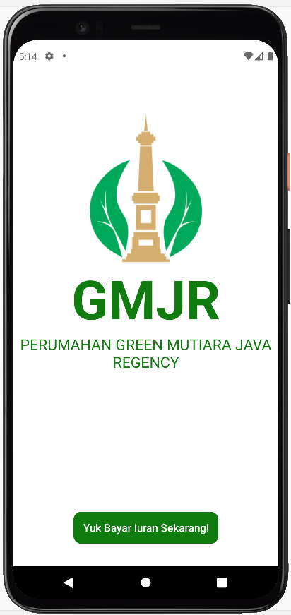
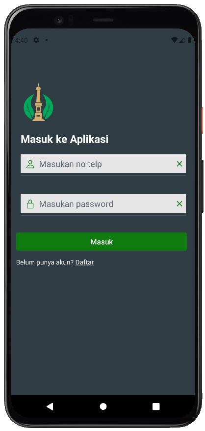
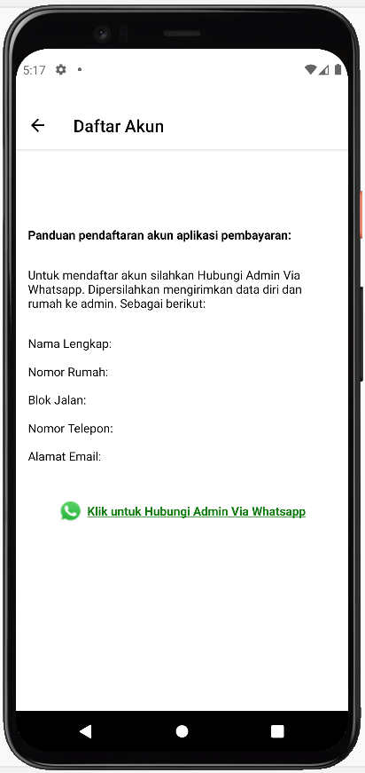
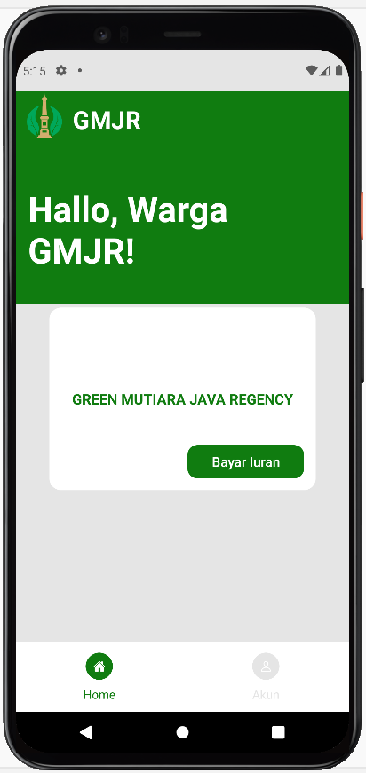
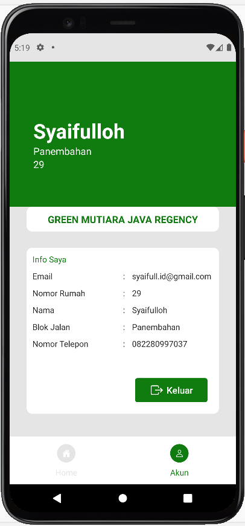
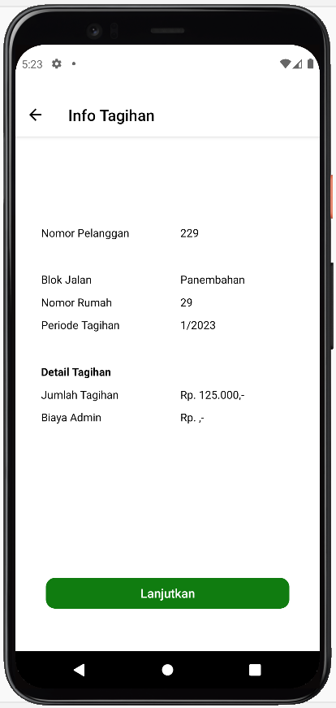
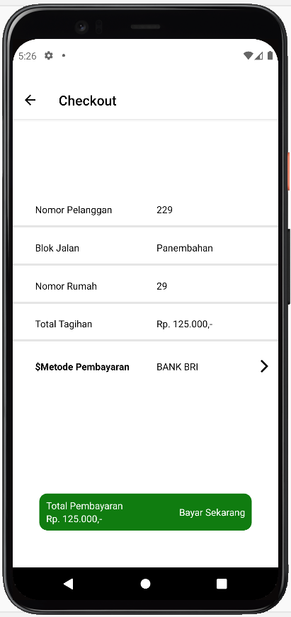
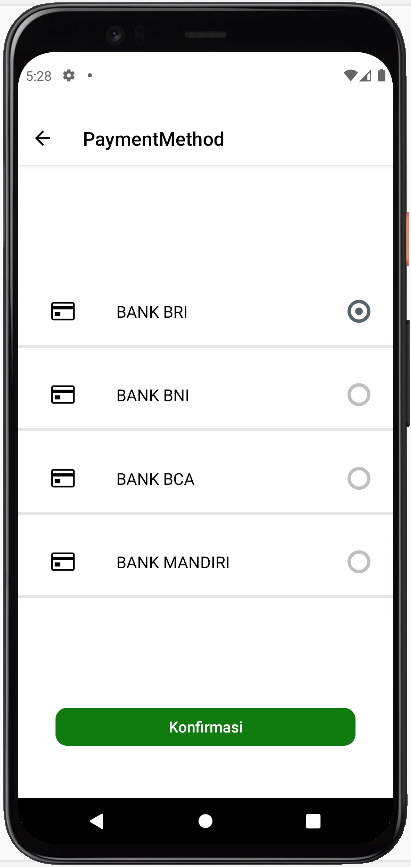
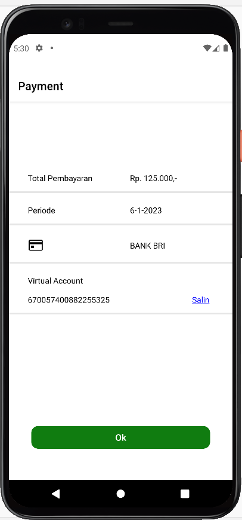
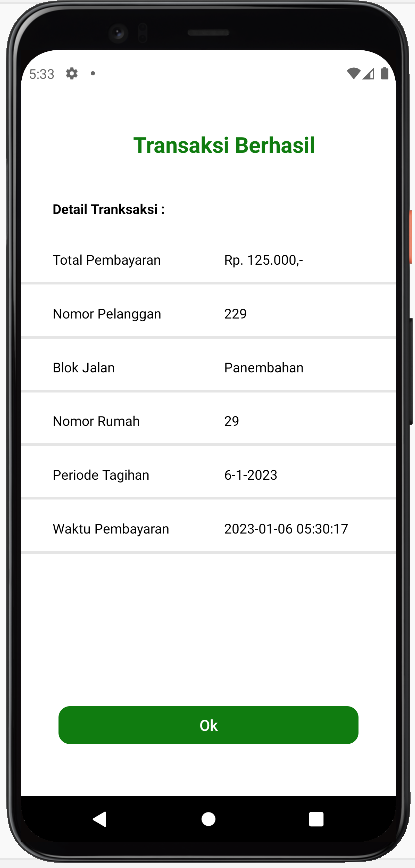

# Mobile Aplikasi Pembayaran Iuran Warga Perumahan Menggunakan Metode Payment Gateway 
(Studi Kasus: Perumahan Green Mutiara Java Regency)

Membuat Aplikasi Pembayaran Iuran Warga Perumahan Berbasis Mobile untuk membantu memudahkan Warga perumahan dalam  melakukan pembayaran secara online dengan menggunakan Metode Payment Gateway dari Midtrans.

### Framework:

- React Native

### Bahasa:

- JavaScript
- Node JS

### Software tool:

- Visual Studio Code
- Android Studio (Emulator)

### Teknologi lainnya:

- Firebase
- Midtrans (Pyment Gateway)

### Fitur:

- Halaman Awal Aplikasii
- Login
- Daftar Akun
- Home
- Akun
- Info Tagihan
- Checkout
- Payment Method
- Payment 
- Status Transaksi

### Tutorial:
- npm install -g expo-cli
- npm start

# Preview

### Screenshot

### Dhasboard Admin Aplikasi Pembayaran Iuran Warga Perumahan Berbasis Web 

- Halaman Awal Aplikasii

- Login

- Daftar Akun

- Home

- Akun

- Info Tagihan

- Checkout

- Payment Method

- Payment

- Status Transaksi

